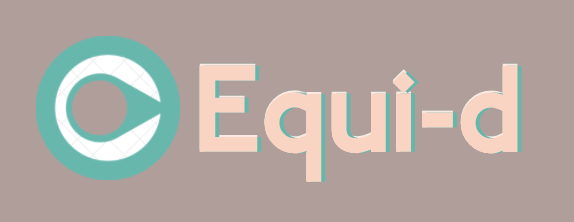

  

<h1>Equi-d </h1>

>### Meet you in the middle...

  

**Equi-d** is a web based 🌎mapplication🌎 helping users to easily find a middle ground. 

  

The app determines the ideal meeting point between two locations anywhere around the globe. 

 gif 

Main features:
- Using Google route information the app finds the equidistant point on the route based on travel duration. 🕒 //PIC 
- User selectable travel modes include driving 🚗, cycling 🚴 and walking🚶🏾‍♂️//PIC 
- Optional feature of Places Of Interest around halfway location //PIC

 gif 

##
- 

## Getting started
-  Make sure you have a valid Google Maps API key more info on that here: https://developers.google.com/maps/documentation/javascript/get-api-key
- enable the following APIs in credentials: -   Geocoding API, Distance Matrix API, Directions API, Maps JavaScript API, Places API
- Fork & clone this repo  
- Run  `npm i`  in server and client directory
- Adjust the necessary env variables to match your system. There's a .env.copy file both in server and client folders to help you with this process.  
- Run `npm start` in server 
- Run `npm start` in client

## Built with
* [React JS](https://reactjs.org/) - "A JavaScript library for building user interfaces."
* [Node.js](https://nodejs.org/en/) - _"Node_.js® is a JavaScript runtime built on Chrome's V8 JavaScript engine."
* [Express JS](https://expressjs.com/) - "Fast, unopinionated, minimalist web framework for Node.js"
* [Google Maps API](https://developers.google.com/maps) - "Build awesome apps with Google's knowledge of the real world."
* [@react-google-maps](https://www.npmjs.com/package/@react-google-maps/api) - Provides bindings to the Google Maps API and lets you use it in your app as React components.
* [Excalidraw](https://excalidraw.com/) - "A virtual collaborative whiteboard tool that lets you easily sketch diagrams that have a hand-drawn feel to them."

## Author

Gabor Halasz -  [Github](https://github.com/gabss405)  -  [LinkedIn](https://www.linkedin.com/in/gaborh/)

## License

This project is licensed under the MIT License.
